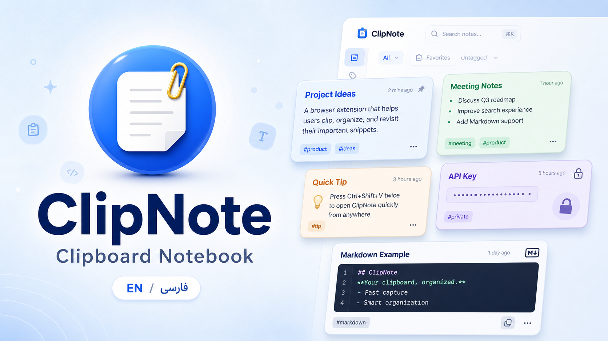
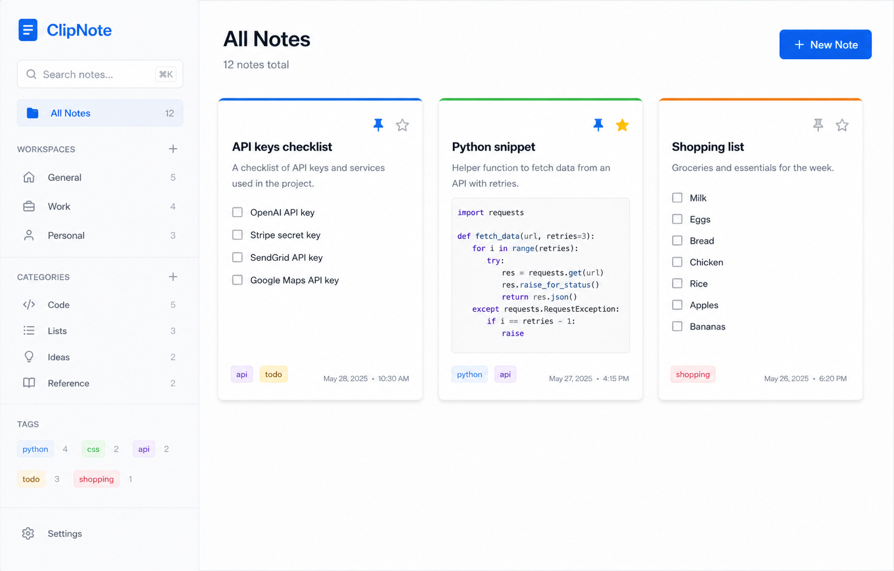
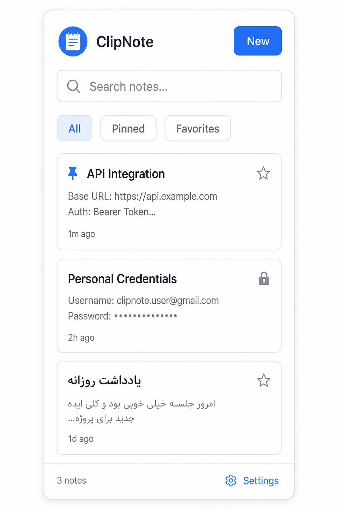

# کلیپ‌نوت

[English](README.md) · [فارسی](README.fa.md)

**یک دفترچه کلیپ‌بورد مدرن، سریع و خصوصی برای کروم.**

[وب‌سایت فارسی](https://kourosh242.github.io/clipnote/fa/) · [ویکی فارسی](https://kourosh242.github.io/clipnote/wiki/fa/) · [Wiki](https://kourosh242.github.io/clipnote/wiki/) · [دانلود نسخه ۱.۳.۰](https://github.com/Kourosh242/clipnote/releases/latest) · [سورس](https://github.com/Kourosh242/clipnote)



کلیپ‌نوت متن انتخاب‌شده از وب، قطعه‌کد، ایده و اطلاعات حساس را به یک دفترچه محلی تبدیل می‌کند که از مرورگر شما خارج نمی‌شود. رابط کاملاً دوزبانه است — انگلیسی و فارسی — و فارسی با فونت **وزیرمتن** و چیدمان راست‌چین کامل نمایش داده می‌شود.

ساختهٔ **کوروش و مهدی**.

## زبان خود را انتخاب کنید

| زبان | فایل | وب‌سایت | ویکی |
| --- | --- | --- | --- |
| فارسی | [README.fa.md](README.fa.md) | [صفحه فارسی](https://kourosh242.github.io/clipnote/fa/) | [ویکی فارسی](https://kourosh242.github.io/clipnote/wiki/fa/) |
| English | [README.md](README.md) | [Landing page](https://kourosh242.github.io/clipnote/) | [Wiki](https://kourosh242.github.io/clipnote/wiki/) |

## چرا کلیپ‌نوت

- **محلی** — یادداشت‌ها در `chrome.storage.local` می‌مانند. بدون حساب، بدون سرور.
- **ذخیره سریع** — متن را در هر صفحه انتخاب کنید، راست‌کلیک کنید، با عنوان و آدرس ذخیره کنید.
- **فضای کاری** — کار، شخصی و پروژه‌های جانبی را جدا نگه دارید.
- **برچسب هوشمند** — پایتون، سی‌اس‌اس، گیت، داکر، جیسون، مارک‌داون و موارد دیگر هنگام نوشتن پیشنهاد می‌شوند.
- **مارک‌داون** — عنوان، جدول، فهرست، تصویر، لینک و بلوک کد قابل کپی.
- **قفل یادداشت** — رمز یا پین چهار رقمی، هش‌شده با PBKDF2-SHA256، سوال بازیابی اختیاری.
- **رابط دوزبانه** — انگلیسی یا فارسی با یک کلیک، وزیرمتن برای متن فارسی.
- **تم** — آبی، سبز، بنفش، نارنجی، دارک پرو و حالت تیره.
- **پشتیبان** — خروجی / ورود JSON (ادغام امن) و خروجی TXT.

<p align="center">
  
</p>
<p align="center">
  
</p>

## نصب

1. فایل [`clipnote_1.3.0.zip`](https://github.com/Kourosh242/clipnote/releases/download/v1.3.0/clipnote_1.3.0.zip) را دانلود کنید.
2. پوشه‌ای را از حالت فشرده خارج کنید که `manifest.json` داخل آن است.
3. `chrome://extensions` را باز کنید و **Developer mode** را روشن کنید.
4. روی **Load unpacked** بزنید و همان پوشه را انتخاب کنید.
5. آیکون را پین کنید. `Ctrl+Shift+N` را بزنید (`⌘+Shift+N` در مک).

از خود این مخزن هم می‌توانید پوشه `clipnote_v1.3.0/` را مستقیم بارگذاری کنید.

## استفاده روزانه

| کار | روش |
| --- | --- |
| گرفتن تکه متن از وب | انتخاب متن → راست‌کلیک → **Save to ClipNote** |
| نوشتن یادداشت سریع | پاپ‌آپ → **جدید** |
| باز کردن دفترچه کامل | پاپ‌آپ → آیکون مدیر، یا صفحه تنظیمات افزونه |
| قفل کردن یک راز | مدیر → محافظت → قفل (رمز یا پین) |
| رفتن به فارسی | تنظیمات → زبان → فارسی |
| انتقال به رایانه دیگر | تنظیمات → خروجی JSON، سپس ورود JSON |

## میانبرها

| عمل | ویندوز / لینوکس | مک |
| --- | --- | --- |
| باز کردن پاپ‌آپ | `Ctrl+Shift+N` | `⌘+Shift+N` |
| یادداشت جدید | `Ctrl+N` | `⌘+N` |
| ذخیره | `Ctrl+S` | `⌘+S` |
| جستجو | `Ctrl+F` | `⌘+F` |
| بستن / برگشت | `Esc` | `Esc` |

## ساختار پروژه

```
clipnote_v1.3.0/     افزونه کروم (Manifest V3)
docs/                سایت گیت‌هاب پیجز، ویکی، وزیرمتن، تصاویر
README.md            راهنمای انگلیسی
README.fa.md         راهنمای فارسی (همین فایل)
```

افزونه unpacked در `clipnote_v1.3.0/` است:

- `manifest.json` — مجوزها، آیکون‌ها، میانبرها
- `background.js` — نصب، منوی راست‌کلیک، هشدار به‌روزرسانی
- `popup.html` / `popup.js` — دفترچه نوار ابزار
- `options.html` / `options.js` — مدیر کامل
- `shared.js` / `shared.css` — ذخیره، مارک‌داون، ترجمه، تم
- `assets/` — فونت‌های woff2 وزیرمتن برای کار کاملاً آفلاین

## حریم خصوصی

یادداشت‌ها جز وقتی خودتان خروجی بگیرید از دستگاه خارج نمی‌شوند. بررسی به‌روزرسانی فقط API عمومی ریلیز گیت‌هاب را می‌خواند. فهرست کامل مجوزها در [حریم خصوصی](https://kourosh242.github.io/clipnote/fa/privacy.html) است.

## مستندات

- وب‌سایت: https://kourosh242.github.io/clipnote/fa/
- ویکی فارسی: https://kourosh242.github.io/clipnote/wiki/fa/
- ویکی انگلیسی: https://kourosh242.github.io/clipnote/wiki/
- ویکی گیت‌هاب: https://github.com/Kourosh242/clipnote/wiki
- تغییرات: [CHANGELOG.md](CHANGELOG.md)

## مشارکت

[CONTRIBUTING.md](CONTRIBUTING.md) را بخوانید. گزارش باگ و ایده امکانات در Issues خوش‌آمد است.

## مجوز

[MIT](LICENSE) © ۲۰۲۶ کوروش و مهدی
